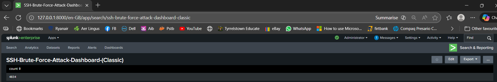
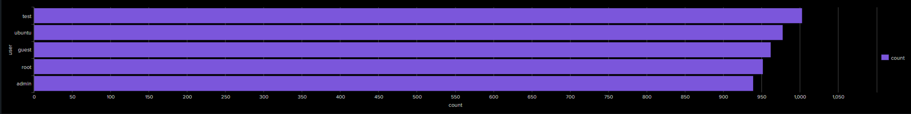
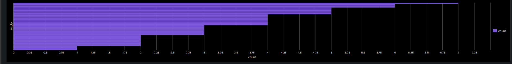

# SSH Brute-Force Detection Using Splunk

A hands-on SOC investigation simulating a real-world brute-force attack scenario, using Splunk to detect, analyse, and report on SSH authentication threats through log analysis, SPL queries, and visual dashboards.

---

## Project Overview

This project demonstrates how Splunk can be used to analyse authentication logs and detect patterns consistent with SSH brute-force attacks. Using a simulated Linux authentication log (`large_auth.log`), the investigation follows a structured SOC analyst workflow from ingestion through to incident reporting.

The objectives of this investigation were to:

- Parse Linux `large_auth.log` authentication logs
- Identify failed and successful SSH login attempts
- Extract attacking source IP addresses
- Detect possible compromised accounts
- Visualise attack trends over time
- Build a SOC-style monitoring dashboard in Splunk Classic

The repository includes screenshots, SPL queries, and a full investigative report.

---

## Dashboards

The following dashboards were built in **Splunk Classic**:

### 1. Total Failed Password Attempts
A single-value panel showing the total number of failed SSH login attempts detected.

### 2. Top Source IPs by Failed Attempts
A table listing the IP addresses responsible for the highest number of failed login attempts.

### 3. Successful Logins After Failed Attempts
A panel showing accepted logins, helping identify accounts that may have been successfully brute-forced.

### 4. Brute-Force Activity Over Time
A timechart visualizing spikes in failed logins throughout the monitored period.

### 5. Most Targeted User Accounts
A bar chart showing which usernames attackers attempted most frequently.

### 6. Distribution of Failed Attempts per Source IP
A histogram displaying the distribution of failed attempts across attacking IP addresses.

---

## SPL Queries Used

### Total Failed Attempts
